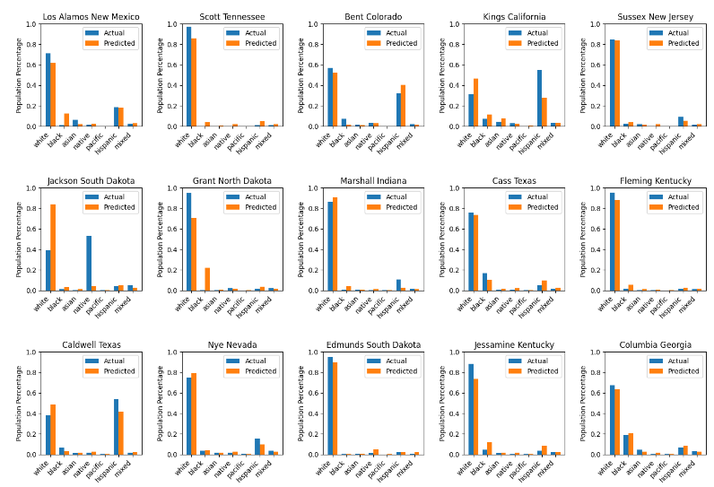
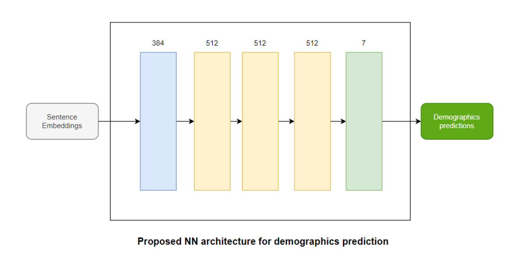
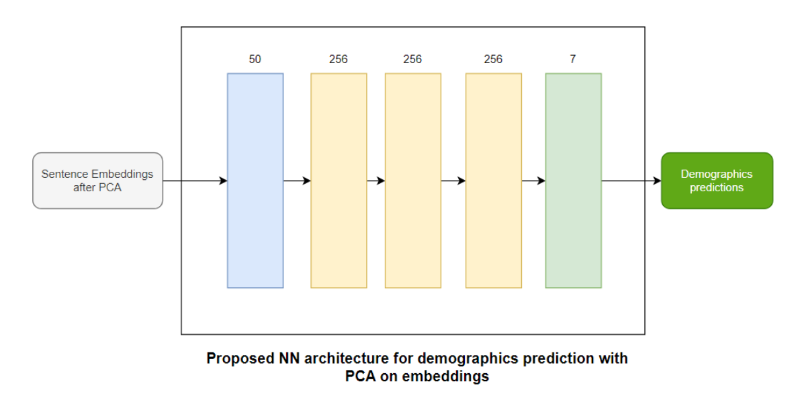
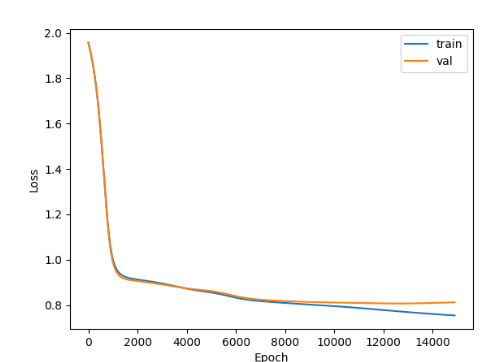

# EASE-ReD: Ethnicity Analysis and Sentence Embedding from Restaurant Distribution

---
[Heorhii Shramko](https://github.com/ShayGeko) | [Eunsong Koh](https://github.com/eunsongkoh) | [Tianyu Liu](https://github.com/tla109)

An exploratory analysis to investigate the potential correlation between restaurant cuisine and the ethnic demographics of the local population.


## Contents

- [Prerequisties](#prerequisties)
  * [Installing Python3](#installing-python3)
  * [Installing Required Libraries](#installing-required-libraries)
- [Running](#run)
- [Report](#report)
  * [Abstract](#abstract)
  * [Acquiring Data](#acquiring-data)
  * [Cleaning Data](#cleaning-data)
  * [Transforming the Data](#transforming-the-data)
  * [Model Architecture and Training](#model-architecture-and-training)
  * [Limitations & Challenges](#limitations---challenges)
  * [Bibliography](#bibliography)


## Prerequisties
To run this project, Python3 and the following libraries must be installed:

### Installing Python3:
Download and install Python3 from the [official website](https://www.python.org/downloads/).

### Installing Required Libraries:
- Pandas
- Numpy
- Pytorch
- Matplotlib
- Sentence_transformers
- Pyspark
- Tqdm
- Sklearn
- Dask
- shutil
- PyYaml


You can install the required Python libraries using `pip`, Python's package installer. Open a terminal or command prompt and execute the following commands:

```bash
pip3 install torch pandas numpy matplotlib pyyaml tqdm scikit-learn dask 
```

## Running 
  ### Step 1. Clone the Repository 
  ```
  git clone git@github.com:ShayGeko/ProjectTourOSM.git
  ```
  ```  
  cd ProjectTourOSM
  ```

  ### Step 2. (Optional) Generate Embeddings:
  Gets the data from ```./bingMaps/restaurantCategory/``` and produce ```./embeddings/pca_category_bing_embeddings.csv```  
  and  ```./embeddingscategory_bing_embeddings.csv```
  
    
    python3 create_embeddings.py
    

  ### Step 3. Train on the Embeddings 
  1) Go to ```configs/ce_pca_category.yml``` and increment the counter in the ```name```  
    e.g. ```name: 'ce-category-embedding-1'``` -> ```name: 'ce-category-embedding-2'```

  2) From the root directory: 
    
    python3 train.py configs/ce_pca_category.yml
    

  will train with CrossEntropy loss on the PCA'd embeddings

If there was a problem with embedding generation (even though there shouldnt be 🙏), you can use the other embedding file for names instead of categories. Just change the config file in **Step 3** from ```ce_pca_category.yml``` to ```ce_pca_name.yml ```

Then one can observe results in under ```experiments/<experiment name from config file>/```
The predictions are stored every 1000 epochs under ```visuals/``` and the loss is plotted iteratively in ```loss.png```


  
  ### Data Visualizations 
  From the root directory:  
      ```python3 visualize.py <experiment name from config file>```

# Report
### **Abstract**

This project delves into examining the potential correlation between the distribution of restaurant cuisines and the ethnic demographic composition of the population, drawing inspiration from OpenStreetMaps. This exploratory analysis aims to investigate how the
distribution of restaurants could provide insights into the demographic makeup of a city. Such insights could be valuable to various industries, including tourism, business owners, and individuals considering financial investments or relocation.

### **Acquiring Data**

Throughout the stages of this project, populations of different locations were considered to ensure the best makeup of data. The two categories of data needed were those on the population of cities throughout the world as well as corresponding restaurant data for that location. </br>
When searching for demographic data, the datasets needed to contain information
regarding the place of origin, place of birth, or ethnic lineage of every city chosen. To maximize
the amount of data points to utilize in our model, finding as many cities or locations as possible
for a state/province, county, or country was desired. After discussing with the professor, we
utilized the Statistics Canada Census Data to find demographic information throughout cities in
Canada. The 2016 Census Data from Statistics Canada was used for its precision, reliability, and
comprehensive city-specific information which included the place of origin of its population. To
gather additional data, two US Census datasets were utilized due to their extensive insights into
the ethnic composition across all counties. Although it was not utilized in the final iterations of
the project and for training, data from Europe was found to contain information on major cities
and countries across the continent such as Berlin, Belgium, and England. These datasets were
found from the official government sites of each respective state. Unfortunately, each country in
Europe had its own format and language for data collection. It was very challenging to put
together a consistent data file, hence the reason it was removed from our final report. By utilizing
sentence embeddings as a data cleaning approach, it allowed the flexibility to work with textual
data. However, it may not be entirely applicable to demographics where pure numbers were
used. Additionally, due to the absence of OpenStreetMaps data and the highly distinct
demographics of the population, Asia was also disregarded because it lacked the high ethnic
diversity of other countries such as the USA or Canada. </br>
When seeking restaurant data, OpenStreetMaps was utilized alongside external
third-party sources: Google Maps Platform, Azure Maps, and Yelp API. Initially, acquiring
restaurant data posed challenges, as existing datasets often lacked information on cuisine type or
city specifics. The original plan was to use the OpenStreetMaps (via Overpass API), as suggested
by one of the project topics. However, we have found the restaurant data to be very incomplete.
In many towns there were less than 5 restaurants placed on map, and even less had a ‘cuisine’ tag
on them. Due to the sparse data from OSM, the model’s predictions left much to be desired. To combat this, Google Maps Platform, Azure Maps, and Yelp API were used for their extensive
information on any locations, restaurant data, and menus. Scripts were created to query both
APIs and were converted from JSON to CSV using the Python requests library. To access
information from the Google Maps Platform, a comprehensive list of global cuisines was created
to query the API. This list was then utilized to query the GMP API, fetching restaurants offering
specific cuisines. Due to the limited amount of Google Cloud credits available to a group
member, the data the Google Maps Platform had to be extended with Microsoft Azure Maps to
find categorical restaurant data for any given location input. Instead of querying multiple cuisine
types, the Azure API had a feature to be queried for a certain category, so the keyword
“Restaurants” was used as input alongside its respective location. A new CSV was created based
on the generation of its output, respective to its area. Additionally, the Yelp API was utilized to
retrieve information on all restaurants within a designated location, generating a CSV of
restaurants alongside their respective cuisines.

**Cleaning Data**

There were numerous formats in which the data was formatted during the collection
process. Subsequently, it was important to analyze any possible outliers and contrasts in data
compared to other datasets, while ensuring a uniform format of information to have accurate
results to study. <br/>

Upon cleaning, numerous issues were found in the Statistics Canada demographic data,
such as improper formatting, inconsistent abbreviations, and extraneous information. As all of
the datasets were of the same format (excluding the population information numbers), before
cleaning, it was validated to ensure that the values were of the correct format and any outliers
were excluded. As there was much-unneeded information in each dataset for every city, inside of
the cleaning script, any irrelevant rows and columns were manually spotted and automated to be
deleted. One of the largest challenges encountered was the column containing the ethnic groups.
Instead of stating the countries, each value was written as a place of origin (eg. Chinese instead
of China). To fix this, a mapping of every data point contained in that column was mapped to a
corresponding country and was then replaced with it.. An additional issue raised was a figure of
"n.o.c/n.o.s" in the Census data from both the USA and Statistics Canada, which indicated "not
otherwise specified." Following a comparison of the two datasets, it was decided to use n.o.s.

The data from the USA Census was discovered to be one sizable dataset, comprising
several counties nationwide. Each county was divided into a separate csv file with its
demographic information as each column included all of the counties. In contrast to the data for
Canada, the remaining step required to complete the data cleaning was deleting rows that served
as "headers" for each of the demographic group's subsections (eg. "Asian origins, total
population" was listed above nations like China, Japan, South Korea, etc.). Instead of manually
counting the rows that needed to be removed, any values that contained a “:” were dropped.
After attempting to predict restaurant data, it was found that there were insufficient data points to
accurately predict the ~150 classes in the USA Census birthplace data. Therefore the data was
switched to the USA Census population estimate by race, which recognized six classes in the US
in 2019. Dask was then utilized to clean and prepare the latter dataset. <br/>

When gathering the data from Yelp API and the Google Maps Platform, the data was
pre-formatted inside of the scripts and then written to the CSV. When the required JSON values
were retrieved from the Azure Maps API, they were formatted with additional whitespace and
irrelevant characters, while a handful of the outputs would only display "restaurant." To prevent
unwanted outputs, restaurants with a single category of “restaurant” were filtered out from the
results. As Python scripts were developed to call APIs and get data, it allowed for greater
flexibility while cleaning data.


### **Transforming the Data**

With the restaurant and demographics data ready and cleaned into an uniform format, the
model training phase was initiated. However, as the restaurant category was human-inputted
(from users to the Azure API), there were no limitations on the types of categories or cuisine
types that could be used. Initially, it was planned to limit the categories to keep only the data that
was categorized as “American”, “Italian”, “German”, etc for every ethnicity. However, even after
addressing typos and case inconsistencies, only a small number of data points yielded a precise
ethnic classification. For example, in OSM, cuisine types classified and formatted as “burgers;
American”, “American-Italian; Pizza”, “Sushi”, etc. were very common. Due to this, another
method was needed in order to utilize the data efficiently as possible. <br/>
Upon conducting literature research to explore new methods, word embeddings such as
word2vec were discovered. In summary, it is a Neural Network that transforms words into
high-dimensional vectors that represent the “semantics” of the word, allowing algebraic
operations to be performed on it without any semantic loss. For example, when defining $𝑒(“𝑤𝑜𝑟𝑑”)$
as the output of such a model:

$$ 𝑒(“𝑘𝑖𝑛𝑔”) − 𝑒(“𝑚𝑎𝑛’) + 𝑒(“𝑤𝑜𝑚𝑎𝑛”) ≅ 𝑒(“𝑞𝑢𝑒𝑒𝑛”) 
$$

$$
 \frac{𝑒(“𝑤ℎ𝑖𝑡𝑒) + 𝑒(“𝑏𝑙𝑎𝑐𝑘”)}{2} ≅ 𝑒(“𝑔𝑟𝑎𝑦”) 
 $$

This served as a better alternative to “clean” the restaurant cuisine data by using a simple
approach to compute the mean of embeddings of all cuisine types for each city or county.
Sentence Embedding (from SentenceTransformers library) was utilized instead of Word
Embedding, as some cuisine types contained more than one word. While this approach was
simple, it proved to be extremely powerful.With embeddings that are no concerns about the
domain of ‘permissible’ cuisine types - anything goes; there are also no longer any worries about
typos or even the 'format'. Beyond that, the pipeline became agnostic to the domain it was trained
on: it switched from OSM cuisine tag to Bing restaurant category tag seamlessly, but was also
agnostic to the feature that it was trained on. But more on this later :) <br/>

There can be reasonable concerns that this approach is too simple, because if there is a
significant label imbalance in the data, getting a mean may overshadow the under-represented
labels. This can be addressed by saying that, “it works great in practice based on our findings
:D”. For the embeddings, the all-MiniLM-L6-v2 model was utilized from the SentenceTransformer
library. It produced 384-dimensional vectors as it was only needed to predict 6 classes. However,
with roughly 3000 counties (and hence data points) for the model to train on, there were
concerns about not having enough data. The rule of thumb we tried to follow was to have
roughly 10x more data than the number of parameters of the model, and with 384 inputs, we are
already beyond that. The solution we leaned towards was to perform Principal Component
Analysis on the embeddings to reduce dimensionality and to simplify our model. We had tried
setting the number of components to 20 and 50, and from our results, 50 performed the best,
albeit only slightly outperforming the ‘raw’ embeddings. On the bright side, it sped up the
training by nearly 2x.

### **Model Architecture and Training**
The model we ended up using is nothing fancy - just a feed forward neural net with 3
hidden layers and He weight initialization implemented in PyTorch. To get good results there
was no need to do anything “over-the-top” because the data coming in is already “digested” by
the sentence embedder.
For training without PCA, we used the following architecture:


For training without PCA, we used the following architecture:


Even though the model is simple, we have decided to switch to PyTorch from Sklearn to
have more control over the optimizer, weights, training and intermediate visualizations.
For the loss, we have experimented with CrossEntropy, Mean Squared Error and Mean Absolute
Error. All three performed reasonably, with MSE giving the best results. We provide the analysis below. </br>

We trained the models with an Adam optimizer with small weight decay (1e-4) for
CrossEntropy and (1e-5) for MSE. We store the avg validation and training loss every 25 epochs, and after training manually choose the model at the state before it starts overfitting. During training, the avg validation and trailing loss were stored every 25 epochs. Then, we chose a model at a state before it started overfitting. For example, in the model below we would use the state of the model at around 9000th epoch. </br>


While we did some hyperparameter tuning, the goal for this project was not to find the
best possible model for demographics prediction, but rather, to explore whether it **can** be learned and reason about the failure cases if those occur. For each of the losses and input data we stopped tuning at having a “good-enough” model.

Here are the visualizations of the PCA CrossEntropy model’s predictions of the first 15
samples (not cherry-picked by us) from the validation dataset:


After training the model on the embedded categories, we wanted to play around with embeddings more, and so we tried training the model on the restaurant names instead.
Now, if the category approach made sense, here we are almost hoping that the embedding model
‘knows’ the restaurants, as it does not make sense to consider a restaurant name such as “Off Tha
Hook” directly as a sentence. On the other hand, the data is much more diverse and many
restaurant names have cuisine’s in them, or things inherent to particular cultures. Furthermore, all
restaurants are part of the dataset, and not just the ones with a category/cuisine tag set. <br/>
The results are very promising!

### **Limitations & Challenges**
Obtaining adequate data for the demographics posed a significant challenge throughout
this project. Although Statistics Canada had data available to be downloaded and viewed on a
website, it did not have the option to obtain data for multiple cities at the same time. Instead, it
would be grouped by province, contrary to what was needed; town, city, or municipality
information. Similarly, the US Census data was attempted to be retrieved in a similar manner via
API, but due to bad documentation, its datasets had to be manually downloaded. To combat this
problem the Stats Canada API was used. However, the documentation was difficult to understand
and was not specific enough to match what specific information was needed. After multiple
attempts to gather data for a certain table, a .zip file was sent in response that contained the
particular dataset. Unfortunately due to the format of the .zip file, it could not be extracted as it
contained one csv containing metadata while the other was 8.5 GB large. None of the computers
that were utilized throughout this project could extract the data due to the size while the internet
speed was not fast enough to upload it to an online drive. Spark and Pandas were used to find the
best way to extract the data; however, due to a memory overflow, one of the devices' memory
disks crashed, resulting in the loss of any scripts and datasets that had not been merged into the
git repository. Not only did this occur for the Canada data, but for the US census data as well
after being modified and generated. This major setback prevented any other data from being
further collected, as well as removing important project files that were created on the branch. In
the end, the datasets were manually downloaded.
Another issue was the need for more data in other areas such as Europe. The language
barrier was a major issue that presented itself when searching for major cities throughout Europe.
Many of the records included unnecessary demographic data, such as gender, age, location, and
so on, without providing information on ethnic origins. For this reason, it was very
time-consuming when searching for datasets as each one would be in their native languages,
resulting in translating titles and websites manually. If a CSV file was discovered, its
demographic information was either imprecise or insufficiently detailed when it came to the
origins of the population. For instance, upon examination of the Berlin data, it was found that
only a variable was used to distinguish between individuals who were born in Berlin or another
location (eg. residents born in Berlin were denoted as D and any other locations were A). To
translate the datasets, a script was constructed using a Python GoogleTrans library, however, it
was found to be inaccurate in many cases.
When utilizing the different APIs to retrieve restaurant data, a lot of information was not
able to be retrieved due to the limit of requests each account had. Although Yelp was free to use,
its total requests were limited, so locations such as Vancouver had outputs of up to 1000 when
there were approximately more than 5000. Alongside this, as there was a limited amount of
credits available for the Google Maps Platform, Azure Bing Maps had to be utilized instead.


### **Bibliography**

Government of Canada, Statistics Canada. “Census Profile, 2016 Census Canada [Country] and Canada [Country].” *Census Profile, 2016 Census - Canada [Country] and Canada [Country]*, 27
Oct. 2021, [statcan.gc.ca/census-recensement/2016/dp-pd/prof/details/page.cfm?Lang=E&Geo1=PR&Code1=01&Geo2=&Code2=&SearchText=Canada&SearchType=Begins&SearchPR=01&B1=All&TABID=1&type=0]( http://www12.statcan.gc.ca/census-recensement/2016/dp-pd/prof/details/page.cfm?Lang=E&Geo1=PR&Code1=01&Geo2=&Code2=&SearchText=Canada&SearchType=Begins&SearchPR=01&B1=All&TABID=1&type=0)

Bureau, United States Census. *Explore Census Data*, [data.census.gov/table/ACSDT5Y2022.B05006?q=United+States&t=Place+of+Birth&g=010XX00US%2C%240500000&moe=false](http://data.census.gov/table/ACSDT5Y2022.B05006?q=United+States&t=Place+of+Birth&g=010XX00US%2C%240500000&moe=false).

*Index of /Programs-Surveys/Popest/Datasets/2010-2019/Counties/ASRH*, [www2.census.gov/programs-surveys/popest/datasets/2010-2019/counties/asrh/](http://www2.census.gov/programs-surveys/popest/datasets/2010-2019/counties/asrh/)

*Cc-Est2019-Alldata.Pdf - Census.Gov*, [www2.census.gov/programs-surveys/popest/technical-documentation/file-layouts/2010-2019/cc-est2019-alldata.pdf](http://www2.census.gov/programs-surveys/popest/technical-documentation/file-layouts/2010-2019/cc-est2019-alldata.pdf)

